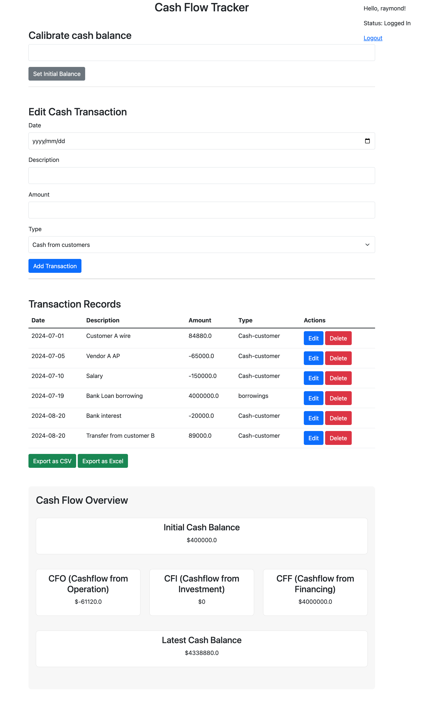
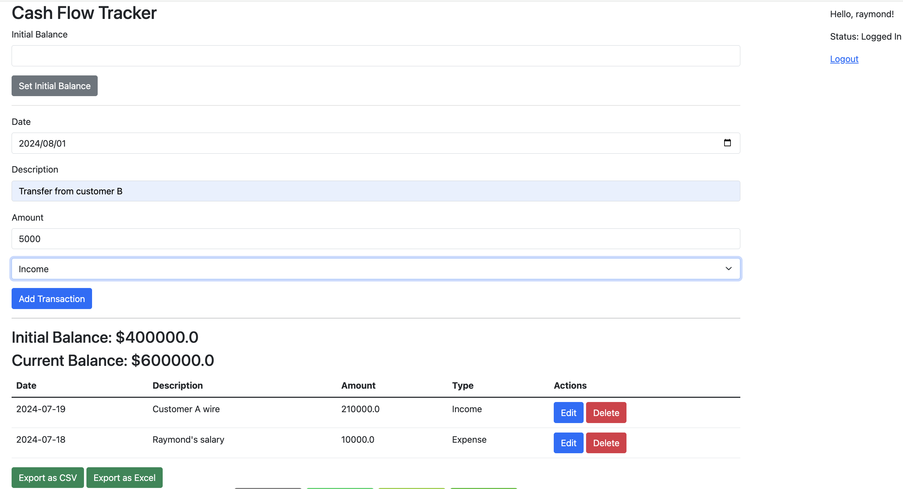
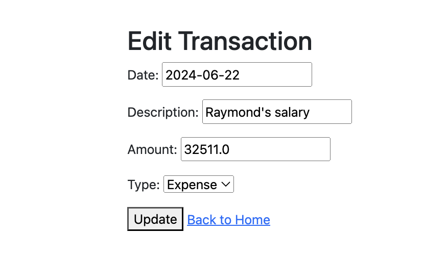
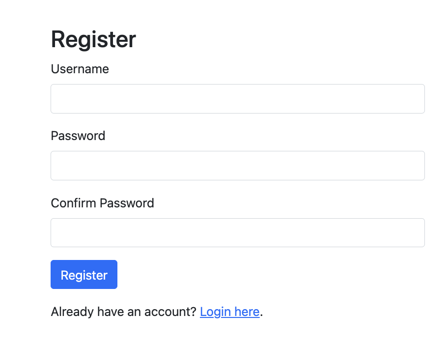
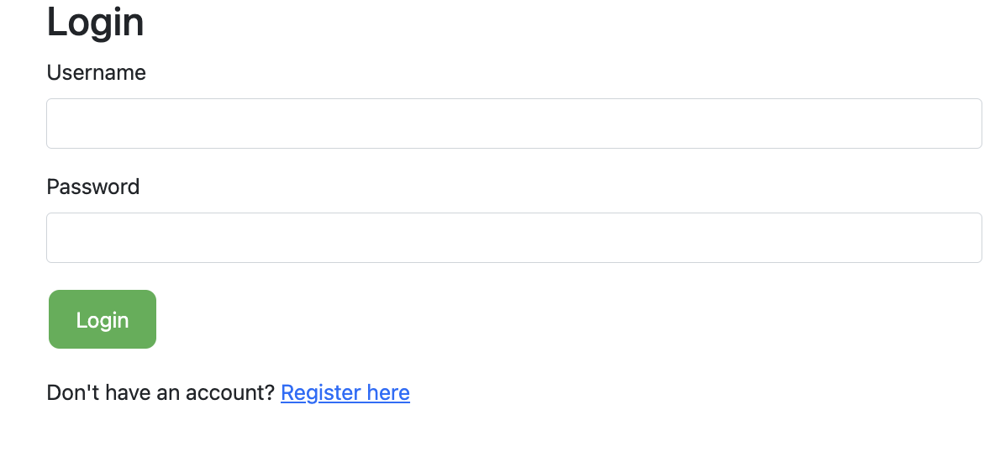

# Cashflow Tracker

## Version 1.1.1-rc1 - Release Date 23 2024
**Feature update**
1. Move the CFO/CFI/CFF and balance overview to top for better visibility
2. Add a switch tab on top for cash flow balance of any specific date


## Version 1.1 - Release Date Aug 20 2024
**Feature update**
1. Update income/expense with more types following financial concepts in cashflow
2. Calculate cashflow from operation(CFO),cashflow from investing(CFI) and cashflow from financing(CFF)
3. Calculate real cashfow from cashflow reporting perspective within the given period
4. Reframe the UI to make it more understandable

**Breakdown of cashflow types**
**Cash flows from operating activities**
* Cash receipts from customers - Add
* Cash payments to suppliers and employees - Minus
* Interest paid - Minus
* Income taxes paid - Minus
* Other operating cash flows - Add/Minus

**Cash flows from investing activities**
* Purchase of property, plant, and equipment - Minus
* Proceeds from sale of property, plant, and equipment - Add
* Purchase of investments - Minus
* Proceeds from sale of investments - Add
* Other investing cash flows - Add/Minus

**Cash flows from financing activities**
* Proceeds from issuing shares - Add
* Proceeds from borrowings - Add
* Repayment of borrowings - Minus
* Dividends paid - Minus
* Other financing cash flows - Add/Minus

## New UI


## Version 1.0 - Release Date Aug 8 2024
This cashflow tracker is a Python Flask based app help a fast team and business owner to quickly note down the cash-in/cash-out and make wise decisions based on the available cash. 

The main features include:
1. Set and update initial cash balance
2. Record cash income
3. Record cash outcome
4. Edit the item type and display sequence
5. Export the cash record in excel and csv format
6. User management

## Background
For a SMB business owner or a lean team who wants to easily track cash activities and collobrate with others without using offline excel file, and not having budget for commercial accounting software. This cash flow tracker is a good to have tool. 

## Prerequisites
You need to install below software and libraries before using the tool
1. Python3 version 3.12
2. Flask version 3.0.3
3. Flask-SQLAlchemy version 3.1.1
4. Pandas 2.2.2

The tool is using built-in SQLite database, you can switch to other powerful databases.

It is recommended to setup a virtual environment and install inside

## Usage
```sh
$ python3 app.py
```

## How to contribute
You are welcome to submit issues or pull request.

## UI Effect
### Main Page

### Record Edit

### User Registration

### User Login
