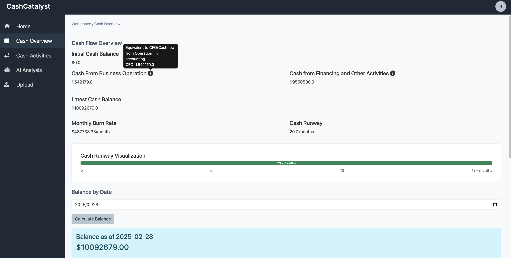
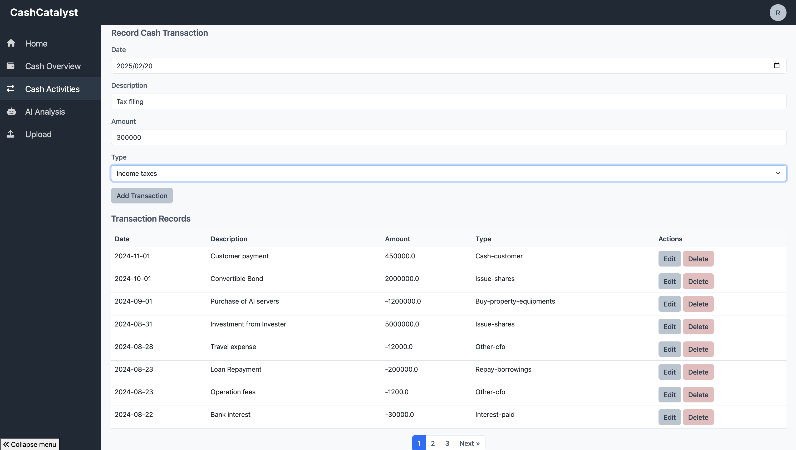
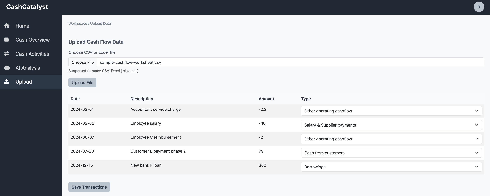

# CashCatalyst - Easy Cash Flow Management

A cash flow tool for non-accounting, non-finance background business ownwers. This is an AI-powered cash flow management system to record, monitor and analysis cashflow and fiannce condition in understandable words, designed for startups and small businesses.

## Features

- 💰 Quick overview of different aspects of your cashflow
- 🤖 AI-powered financial analysis and forecasting
- 📊 Interactive charts and visualizations
- 📥 Cash transaction records bulk upload by file
- 👥 Multi-user support and authentication
- 💼 Business-oriented UI/UX
- 🌐 Multilingual support (English, Spanish, French, Japanese, Chinese)

## Quick Start

1. Clone the repository
2. Install dependencies: `pip install -r requirements.txt`
3. Set up environment variables(Anthropic LLM API key)
4. Start the server: `python3.11 main.py`

## Documentation

For detailed instructions on installation, configuration, and usage, please refer to our:

- [User Guide](doc/USER_GUIDE.md)
- [Cashflow bulk update template](sample-cashflow-worksheet.csv)

## Multilingual Support

CashCatalyst now supports multiple languages:

- English (en)
- Spanish (es)
- Japanese (ja)

Users can switch languages using the language dropdown in the application header.

## Tech Stack

- **Backend:** Flask, SQLAlchemy, Python 3.11+
- **Frontend:** JavaScript, Chart.js, Bootstrap 5
- **Database:** PostgreSQL/SQLite
- **AI/ML:** Anthropic Claude API
- **Internationalization:** Flask-Babel
- **DevOps:** Docker, GitHub Actions

## Contributing

1. Fork the repository
2. Create your feature branch
3. Commit your changes
4. Push to the branch
5. Create a Pull Request

## License

This project is licensed under the Apache-2.0 License - see the [LICENSE](LICENSE) file for details.

## Support

For support, please:
1. Check the [User Guide](doc/USER_GUIDE.md)
2. Search [existing issues](https://github.com/yourusername/cash-flow-tracker/issues)
3. Create a new issue if needed
