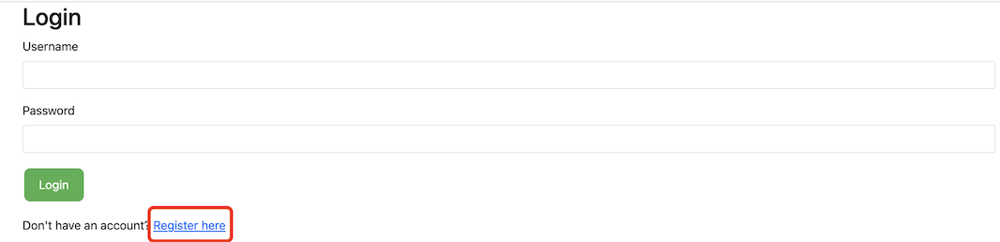
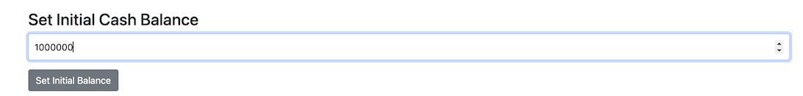
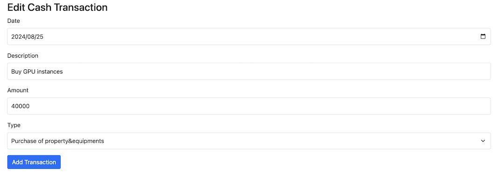
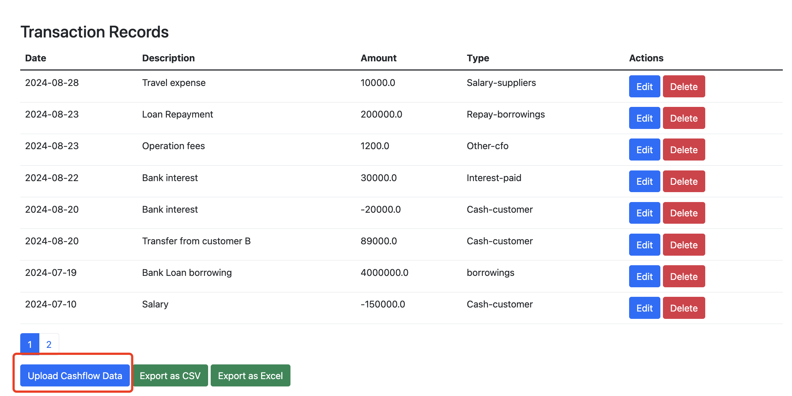
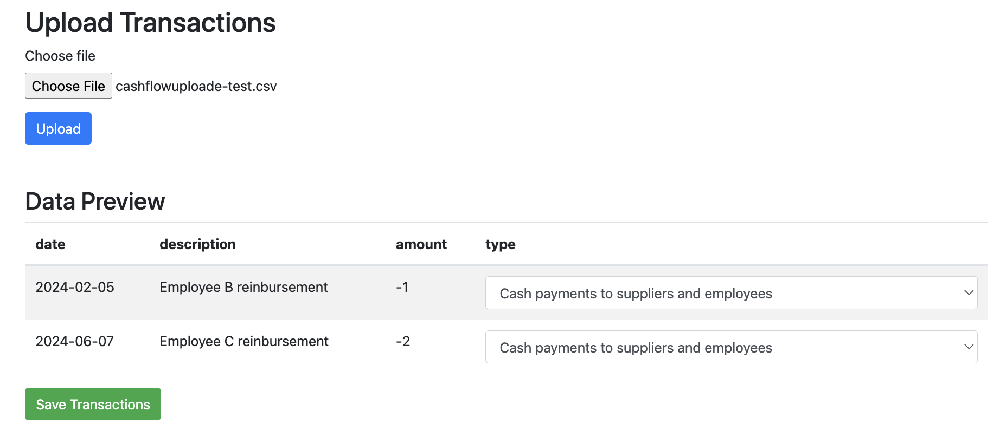
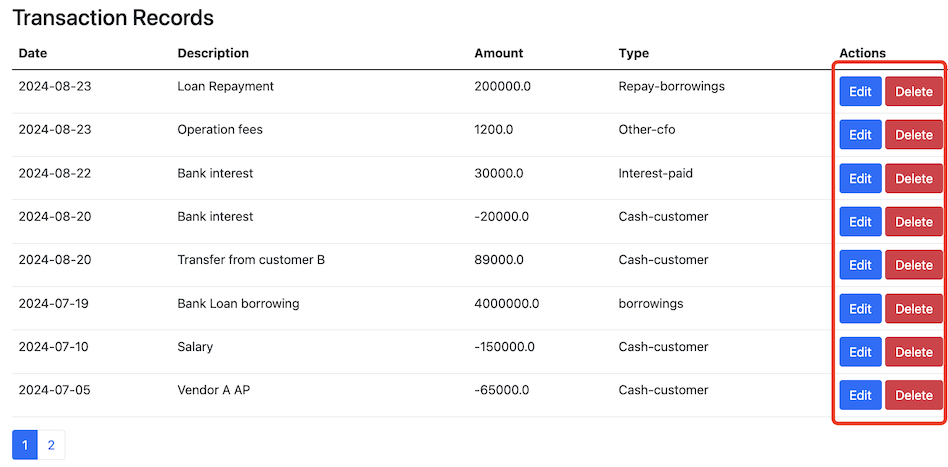
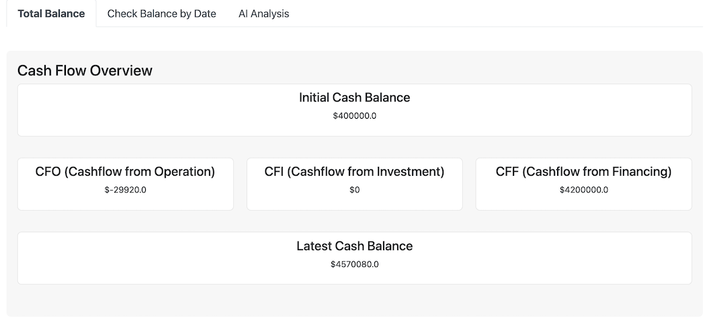
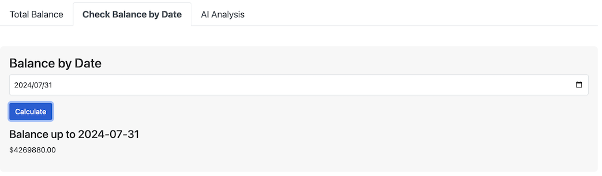
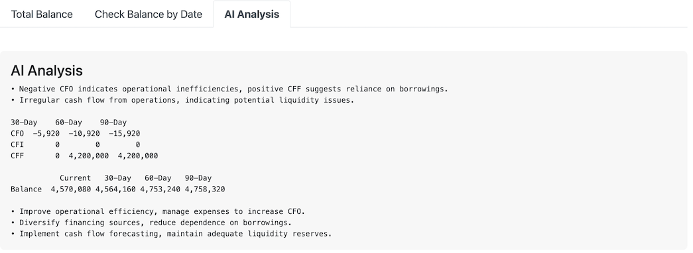

# &#x1F3E6; CashCatalyst - Cash Flow Management

## &#9889; About this project
For individuals or lean teams managing the finances of a business, cash flow is fundamental and has the most direct and immediate impact on operations. This tool helps you easily record cash activities, intelligently analyze your business's cash flow based on financial accounting principles, and collaborate with team members.

## &#10024; Core Features
1. **Easly record** and edit each cashflow record
2. **Upload your own** cashflow record file for data integration
3. **AI analysis** based on cashflow record
4. **Cashflow summary** under finance report perspective
5. **Check and predict** cashflow balance
6. **Share and collaborate** with other memebers

## &#128640; Quick Start
### 1. Clone the repository
Look for green "Code" button at the top right of your code page. For those not familiar with the procedure, please refer to github doc:\ 
https://docs.github.com/en/repositories/creating-and-managing-repositories/cloning-a-repository

### 2. Install the libraries
The required libraries are inside `requirements.txt`, you can install them by `pip install -r requirements.txt`.
You're suggested to do that in a virtual environment, to create, activate and deactive virtual environment in your project folder, steps are:
```sh
1. $ python -m venv <your_venv_name>
2. $ source venv_name/bin/activate (linux or Max)
   $ venv_name\Scripts\activate (Windows)
```
If you want to deactivate it, just run
```sh
deactivate
```

### 5. Configure LLM API key
This app uses Anthropic Claude API for AI function.  To use this part,you need to setup your own API.\
1. Inside your project root folder, rename the `.env.example` dummy file to `.env`
2. Replace the dummy values in .env with your actual API keys

### 4. Launch the app
```sh
$ python3 app.py or $python app.py
```

### 5. Database
The tool is using SQLite database, you can switch to other databases if your requirement changes

### 6. Open console
1. Open browser type `http://127.0.0.1:5000/` the default local address or your custom address

## &#128161; User Guide
1. App requires login, user can choose register account and login again


2. Set initial cash balance - what you have in hand


3. Record Cash Activity in "Edit Cash Transaction" from the webpage, positive/negative cash amount means cash inflow/outflow, choose the corresponding type


4. User can also upload their cashflow worksheet into editing, `.csv/.xlx/.xlsx` formats supported.Right now uploaded file has to follow the template format, sample worksheet is included in the repo as `sample-cashflow-worksheet.csv`


5. The data inside uploaded file will display in the "Data Preview" frame, user can match each record with cashflow type from dropdown list. By Clicking the save button, result will be uploaded and combined with existing cashflow table


6. Edit or delete the record from "Transaction Records", you can also drag and drop record to adjust position


7. Export cash record table as csv/excel for collaboration and future edition

8. The main form will automatically calculate latest balance, and three fundamental cashflow financial elements


9. Switch to the second tab of homepage, user can calculate the accurate balance on specific date


10. Thrid tab on homepage is the AI analysis based on cash status, it'll give forecast and suggestion


## ❤️ Stargazers
[](https://github.com/raymond0208/CashCatalyst/stargazers)
## ❤️ Forkers
[](https://github.com/raymond0208/CashCatalyst/network/members)

