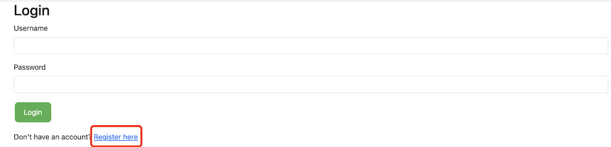
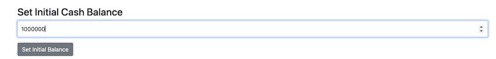
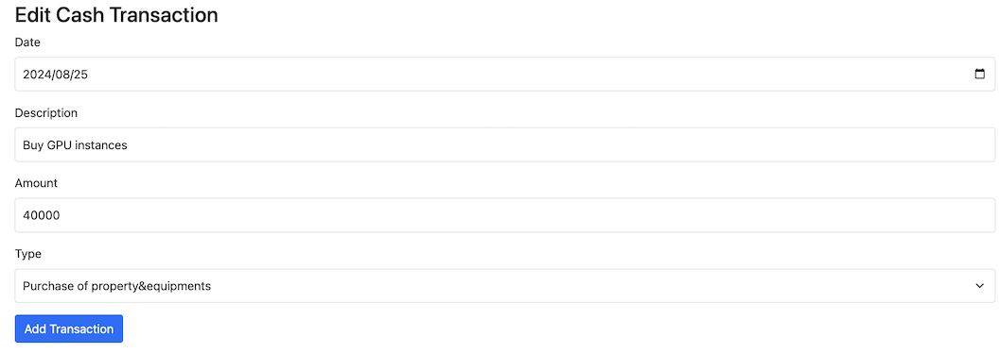
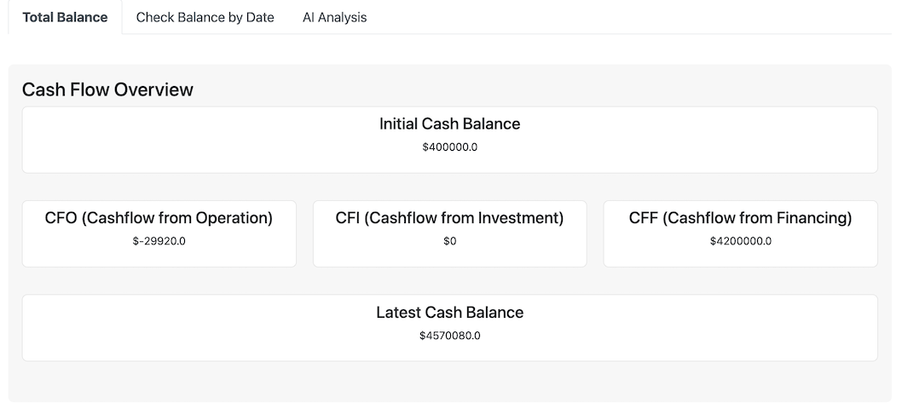
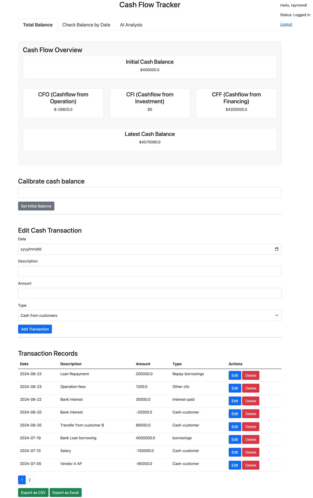

# CashCatalyst - Cash Flow Management

## About this project
For individuals or lean teams managing the finances of a business, cash flow is fundamental and has the most direct and immediate impact on operations. This tool helps you easily record cash activities, intelligently analyze your business's cash flow based on financial accounting principles, and collaborate with team members.

## How to launch the app
### 1. Clone the repository
Look for green "Code" button at the top right of your code page. For those not familiar with the procedure, please refer to github doc:\ 
https://docs.github.com/en/repositories/creating-and-managing-repositories/cloning-a-repository

### 2. Install the libraries
The required libraries are inside `requirements.txt`, you can install them by `pip install -r requirements.txt`.
You're suggested to do that in a virtual environment, to create, activate and deactive virtual environment in your project folder, steps are:
```sh
1. $ python -m venv <your_venv_name>
2. $ source venv_name/bin/activate (linux or Max)
   $ venv_name\Scripts\activate (Windows)
```
If you want to deactivate it, just run
```sh
deactivate
```

### 5. Configure LLM API key
This app uses Anthropic Claude API for AI function.  To use this part,you need to setup your own API.\
1. Inside your project root folder, rename the `.env.example` dummy file to `.env`
2. Replace the dummy values in .env with your actual API keys

### 4. Launch the app
```sh
$ python3 app.py or $python app.py
```

### 5. Database
The tool is using SQLite database, you can switch to other databases if your requirement changes

## How to use the app after launch
1. Open browser type `http://127.0.0.1:5000/` the default local address or your custom address

2. App requires login, user can choose register account and login again


3. Set initial cash balance - what you have in hand


4. Record Cash Activity in "Edit Cash Transaction", choose the corresponding type


5. Edit or delete the record from "Transaction Records", you can also drag and drop it


6. Export cash record table as csv/excel for further use

7. The main form will automatically calculate latest balance, and three fundamental cashflow financial elements


8. Switch to the second tab of homepage, user can calculate the accurate balance on specific date


9. Thrid tab on homepage is the AI analysis based on cash status, it'll give forecast and suggestion


## How to contribute
You are welcome to submit issues or pull request.


# Release Notes
## Version 1.1.1-rc1 - Release Date Aug 25 2024
**Feature update**
1. Add AI capability to analyze cashflow status and do forecast
2. Add feature to calculate balance of any specific date
3. Move the financial indicator overview and above two features as tabs on top
4. Add pagination to table records


## Version 1.1 - Release Date Aug 20 2024
**Feature update**
1. Update income/expense with more types following financial concepts in cashflow
2. Calculate cashflow from operation(CFO),cashflow from investing(CFI) and cashflow from financing(CFF)
3. Calculate real cashfow from cashflow reporting perspective within the given period
4. Reframe the UI to make it more understandable

**Breakdown of cashflow types**
**Cash flows from operating activities**
* Cash receipts from customers - Add
* Cash payments to suppliers and employees - Minus
* Interest paid - Minus
* Income taxes paid - Minus
* Other operating cash flows - Add/Minus

**Cash flows from investing activities**
* Purchase of property, plant, and equipment - Minus
* Proceeds from sale of property, plant, and equipment - Add
* Purchase of investments - Minus
* Proceeds from sale of investments - Add
* Other investing cash flows - Add/Minus

**Cash flows from financing activities**
* Proceeds from issuing shares - Add
* Proceeds from borrowings - Add
* Repayment of borrowings - Minus
* Dividends paid - Minus
* Other financing cash flows - Add/Minus


## Version 1.0 - Release Date Aug 8 2024
This cashflow tracker is a Python Flask based app help a fast team and business owner to quickly note down the cash-in/cash-out and make wise decisions based on the available cash. 

The main features include:
1. Set and update initial cash balance
2. Record cash income
3. Record cash outcome
4. Edit the item type and display sequence
5. Export the cash record in excel and csv format
6. User management

## UI main page

