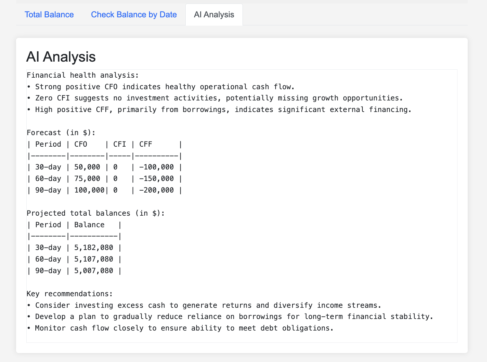

# &#x1F3E6; CashCatalyst: AI-Powered Cash Flow Management 🚀💰

## 🌟 Revolutionize Your Business Finance
For individuals or lean teams managing the finances of a business, cash flow is fundamental and has the most direct and CashCatalyst is your ultimate companion for mastering cash flow management. Whether you're an entrepreneur, small business owner, or part of a lean finance team, our tool harnesses cutting-edge AI to transform the way you handle your business's lifeblood - cash.

## 🎯 Why CashCatalyst?

AI-Driven Insights: Get expert analysis and predictions for your cash flow scenarios.
Automatic Reporting: Generate professional cash flow statements with a click.
User-Friendly Interface: Easily record and manage your cash activities.
Collaborative: Share and work together with your team seamlessly.

## &#10024; Core Features
1. 🤖 **AI Analysis:** Get deep insights into your cash flow patterns and trends.  
2. 📊 **Auto-Generated Statements:** Create finance-ready cash flow reports instantly.  
3. 📝 **Easy Data Entry:** Record cash activities quickly and effortlessly.  
4. 💼 **Financial Overview:** View your cash flow summary from a professional finance perspective.  
5. 🔮 **Balance Forecasting:** Check current balances and predict future cash positions.  
6. 🤝 **Team Collaboration:** Share data and insights with your team members.  

## &#128640; Quick Start
### 1. Clone the repository

```bash
git clone https://github.com/raymond0208/CashCatalyst.git
cd CashCatalyst
```

### 2. Set Up Your Environment

```sh
python -m venv cashcatalyst_env
source cashcatalyst_env/bin/activate  # On Windows use `cashcatalyst_env\Scripts\activate`
pip install -r requirements.txt
```

### 3. Configure AI Magic
Create a `.env` file in the project root and add your Anthropic API key:

```sh
ANTHROPIC_API_KEY=your_api_key_here
```

### 4. Launch CashCatalyst
```sh
python3 main.py or python main.py
```

### 5. Access Your Financial Command Center

Open your browser and navigate to `http://127.0.0.1:5000/`


### 6. Open console
1. Open browser type `http://127.0.0.1:5000/` the default local address or your custom address

## &#128161; User Guide Highlights
* **Secure Login:** Start by creating your account or logging in.  
* **Initial Setup:** Set your starting cash balance.  
* **Record Transactions:** Easily input cash activities through the intuitive interface.  
* **Data Import:** Upload existing cash flow data in CSV or Excel formats.  
* **Powerful Insights:** Use the AI tab for in-depth analysis and forecasting.  
* **Export & Share:** Download your data for offline use or team collaboration.  

## 📸 CashCatalyst in Action

  
*Secure access to financial data*


  
*Easily manage your cash transactions*



*Get AI-powered insights for smarter financial decisions*

## 🤝 Support and Feedback
We're constantly improving CashCatalyst. If you have any questions, suggestions, or encounter any issues, please open an issue on our GitHub repository. Your feedback is invaluable!


## ❤️ Stargazers
[](https://github.com/raymond0208/CashCatalyst/stargazers)
## ❤️ Forkers
[](https://github.com/raymond0208/CashCatalyst/network/members)