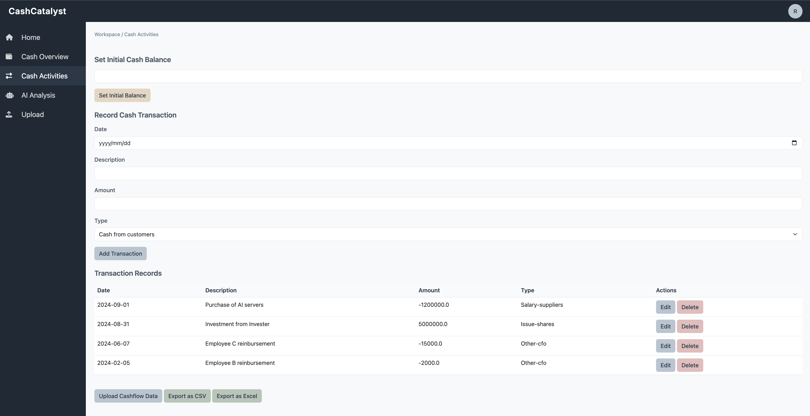

# CashCatalyst - Cash Flow Management System

CashCatalyst is a modern web application for tracking and analyzing cash flow, built with Flask and modern web technologies. It provides comprehensive tools for managing transactions, analyzing cash flow patterns, and generating financial insights.

## Features

### 1. User Management
- Secure user authentication system
- Personalized dashboards for each user
- User preferences and settings management
- Profile customization options

### 2. Cash Flow Overview

- Real-time cash balance tracking
- Breakdown of cash flows by category:
  - Cash Flow from Operations (CFO)
  - Cash Flow from Investments (CFI)
  - Cash Flow from Financing (CFF)
- Monthly balance trend visualization
- Initial balance management

### 3. Transaction Management

- Record and track individual transactions
- Categorize transactions by type
- Filter and search functionality
- Pagination for better performance
- Edit and delete transactions
- Balance calculation by date

### 4. AI-Powered Analysis

- Advanced financial pattern recognition
- Risk assessment metrics
- Seasonal trend analysis
- 90-day cash flow forecasting
- Automated cash flow statement generation

### 5. Data Import/Export
- Upload transactions from CSV/Excel files
- Export transactions to CSV/Excel
- Bulk transaction processing
- Data validation and preview

## Technology Stack

- **Backend**: Python Flask
- **Database**: SQLite with SQLAlchemy ORM
- **Frontend**: HTML5, CSS3, JavaScript
- **UI Framework**: Bootstrap 5
- **Charts**: Chart.js
- **Icons**: Font Awesome
- **Data Processing**: Pandas, NumPy
- **Visualization**: Matplotlib

## Installation

1. Clone the repository:
```bash
git clone https://github.com/yourusername/cashcatalyst.git
cd cashcatalyst
```

2. Create and activate a virtual environment:
```bash
python -m venv venv
source venv/bin/activate  # On Windows: venv\Scripts\activate
```

3. Install dependencies:
```bash
pip install -r requirements.txt
```

4. Initialize the database:
```bash
flask db init
flask db migrate
flask db upgrade
```

5. Run the application:
```bash
flask run
```

The application will be available at `http://localhost:5000`

## Usage

1. **Registration/Login**
   - Create a new account or login with existing credentials
   - Customize your profile settings

2. **Cash Overview**
   - View your current cash position
   - Set initial balance
   - Monitor cash flow trends
   - View monthly balance chart

3. **Cash Activities**
   - Add new transactions
   - View transaction history
   - Calculate balance by date
   - Edit or delete transactions

4. **AI Analysis**
   - Generate advanced financial analysis
   - View cash flow patterns
   - Check risk metrics
   - Download cash flow statements

5. **Data Management**
   - Import transactions from files
   - Export data for reporting
   - Manage transaction categories

## Security Features

- Password hashing using Werkzeug
- User session management
- CSRF protection
- Secure form handling
- User-specific data isolation

## Contributing

1. Fork the repository
2. Create a feature branch
3. Commit your changes
4. Push to the branch
5. Create a Pull Request

## License

This project is licensed under the Apache-2.0 license License - see the LICENSE file for details.

## Acknowledgments

## ❤️ Stargazers
[](https://github.com/raymond0208/CashCatalyst/stargazers)
## ❤️ Forkers
[](https://github.com/raymond0208/CashCatalyst/network/members)
